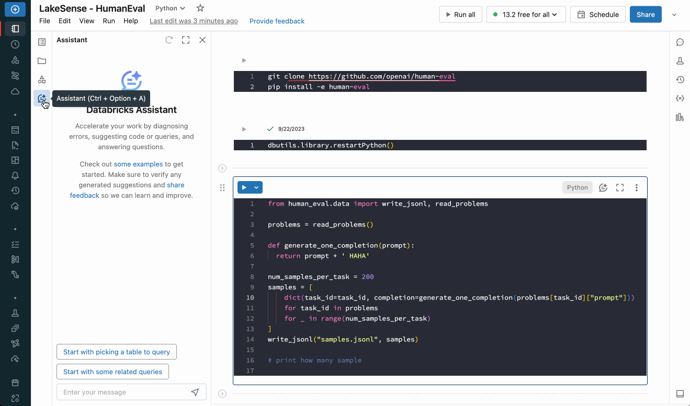

# Databricks AI Assistant

### [Introducing Databricks Assistant, a context-aware AI assistant](https://www.databricks.com/blog/introducing-databricks-assistant)

### [Databricks Assistant FAQ](https://learn.microsoft.com/en-us/azure/databricks/notebooks/databricks-assistant-faq)

### [Databricks Assistant: sample tasks](https://learn.microsoft.com/en-us/azure/databricks/notebooks/databricks-assistant-examples)

The Assistant leverages Unity Catalog / Workspace content to understand your tables / code and popular data assets across your company to provide responses that are personalized to you.

#### Available via three main entry points:

- Main Chat
- Inline Chats
- Ghost Text Copilot Style suggestions / Suggesting Better default Names

#### Video Demo

https://youtu.be/g9REIGKkAVo?si=LBKGzrUjFu6J-EFb
